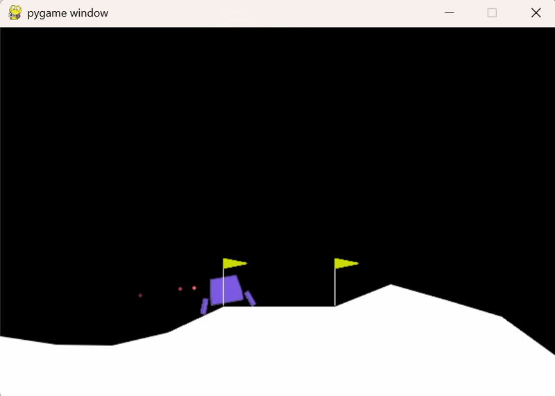

# Autonomous Lunar Lander Pilot using Deep Q-Networks (DQN)

This repository contains a production-ready implementation of a Deep Q-Network (DQN) agent trained to solve OpenAI Gymnasium's **LunarLander-v3** environment. The agent effectively learns an optimal control policy to navigate unstable lunar gravity and land safely between the flags.

<p align="center">
  
</p>

## 🌐 Live Web Application
The trained policy is deployed as an interactive web app using Streamlit Cloud. You can watch the agent execute autonomous evaluation flights directly from your browser without local setups:
👉 **[Launch Live Streamlit Application](https://lunar-lander-dqn.streamlit.app/)**

---

## 🧠 Core Architecture & Methodology

The reinforcement learning pipeline leverages a classic **Deep Q-Network (DQN)** coupled with key engineering mechanisms:
* **Deep Neural Network (`src/model.py`):** A PyTorch multi-layer perceptron (MLP) that maps the 8-dimensional continuous state space (coordinates, velocities, angle, angular velocity, and leg contact sensors) to 4 discrete actions.
* **Experience Replay Buffer (`src/buffer.py`):** A cyclic memory structure storing up to 100,000 transition tuples $(s, a, r, s', \text{done})$ to stabilize training by breaking temporal data correlations through uniform mini-batch sampling.
* **Exploration-Exploitation Strategy:** Dynamic Epsilon-Greedy policy starting at $\epsilon = 1.0$ and decaying down to a minimum floor of $\epsilon_{min} = 0.01$.
* **Deterministic Evaluation:** During web app evaluation flights, exploration is completely deactivated ($\epsilon = 0.0$), ensuring 100% deterministic, analytical decision-making based on learned Q-values.

---

## 📊 Evaluation & Performance Target

* **Training Optimization:** The agent was trained for 2,000 computational episodes using vectorized execution with graphics disabled (`render_mode=None`) for maximum training throughput.
* **Autonomous Efficiency:** The network successfully solves the environment by consistently achieving steady positive scores, peaking at evaluation rewards over **+250 points**.

---

## 🛠️ Installation & Local Usage

### 1. Clone the Repository
```bash
git clone https://github.com/pablopresa-dev/lunar-lander-dqn.git
cd lunar-lander-dqn
```
### 2. Set Up the Virtual Environment
```bash
python -m venv venv
source venv/Scripts/activate  # On Windows: venv\Scripts\activate
pip install -r requirements.txt
```

### 3. Execution Scripts
```bash
## Train the agent from scratch:
python train.py
## Test the pre-trained weights locally with visual rendering (Pygame)
python test.py
## Launch the Streamlit web server locally:
python -m streamlit run app.py
```

---

## 📜 License
This project is licensed under the MIT License - see the LICENSE file for details.